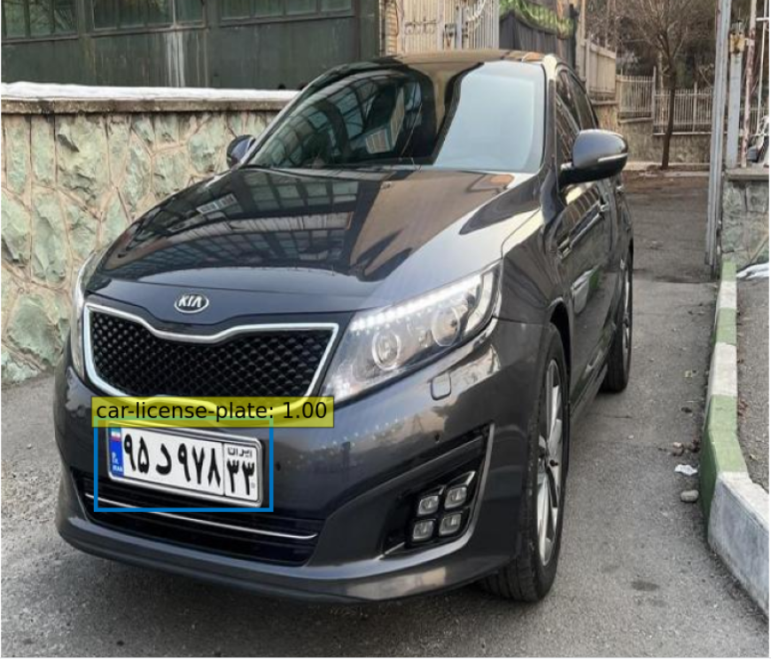
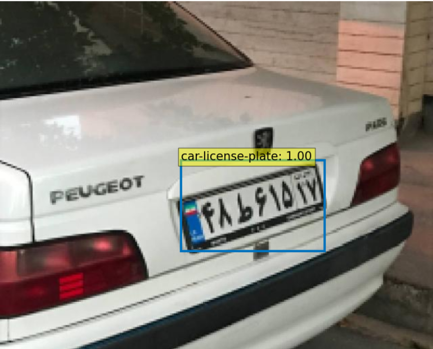

# Fine-Tuning DETR for License Plate Detection

This repository contains code for fine-tuning the DETR (DEtection TRansformers) model for license plate detection. It enables the model to identify and locate license plates in images. The DETR model is a powerful transformer-based object detection architecture that has shown impressive performance in various object detection tasks.





## Dataset

The  dataset is available on my Kaggle account. You can download it by following this [link](https://www.kaggle.com/datasets/fatemehfarnaghizadeh/car-license-plate-ir).


## Getting Started

To get started with this project, follow these steps:

### Clone the Repository

```bash
git https://github.com/Fatemeh-Farnaghizadeh/License-Plate-Detection-using-DETR-Model.git
cd DETR_FINETUNING
python -m venv venv
.\venv\Scripts\activate
pip install -r requirements.txt 
```
### Training

For the complete data loading and training process, refer to the [DETR-Fine-Tuning Notebook](DETR-Fine-Tuning.ipynb).

## Kaggle Notebook

I have also created a Kaggle notebook related to this repository. You can check it out [here](https://www.kaggle.com/code/fatemehfarnaghizadeh/fine-tuning-detr-model-objectdetection/notebook).